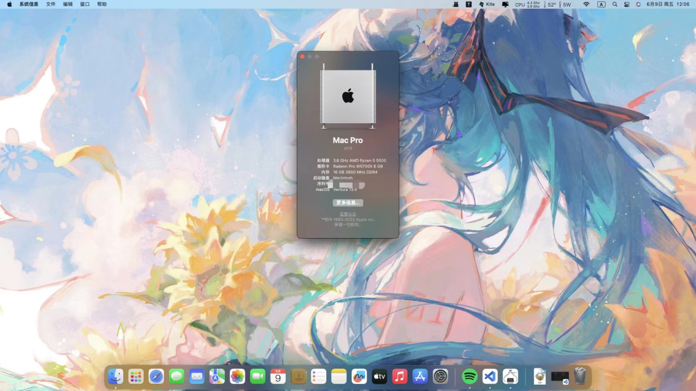

# Hackintosh OpenCore EFI

## Device Information

| Item | Information |
| - | - |
| Motherboard | PRIME B450M-K II ASUSTeK COMPUTER INC. |
| RAM | 16GB (8GB x2) KingBank HeatSink @ 3600MHz |
| CPU | AMD Ryzen 5 5500 |
| GPU | ASUSTeK TUF GAMING RX 5600 XT |
| SSD | Samsung 980 1TB |
| Audio Chipset | ALC897 |
| WiFi & Bluetooth | Intel AX210 |
| Ethernet | Realtek RTL8111 |

## Screenshots

## BIOS Settings

| Item | Configuration |
| - | - |
| Resizable Bar | Enabled |
| Above 4G Decoding | Enabled |
| Serial Ports | Disabled |
| AMD SVM | Enabled |
| CSM | Disabled |
| Secure Boot | Disabled |
| EHCI/XHCI Hand-off | Enabled |

## Known Issue

Virtualization is broken (See Ryzen-Hackintosh Repository: [Link](https://github.com/mikigal/ryzen-hackintosh#virtualization))

## Notes
SMBIOS Information has been cleared, you need to generate one manually.

## Credits

- [Apple](https://apple.com) for macOS
- [AMD-OSX Developers](https://github.com/AMD-OSX) for kernel patches for AMD CPUs
- [Acidanthera](https://github.com/acidanthera) for OpenCore and most of used kexts
- [Trulyspinach](https://github.com/trulyspinach) for Ryzen power management and monitoring kexts
- [Mieze](https://github.com/Mieze) for RealtekRTL8111 kext
- [DhinakG](https://github.com/USBToolBox) for USBToolBox
- [XLNC](https://github.com/naveenkrdy) for Adobe patches for AMD CPUs and AppleMCEReportedDisabler kext
- [Pavo](https://github.com/Pavo-IM) for research about AppleMCEReportedDisabler in Monterey
- [tomnic](https://www.macos86.it/profile/69-tomnic/) for libfakeintel.dylib used by Adobe patches
- [Dortania](https://github.com/dortania) for OpenCore configuration guides
- [PCBeta Community](https://bbs.pcbeta.com) and [AMD-OSX Comunity](https://forum.amd-osx.com/) for support while making my Hackintosh